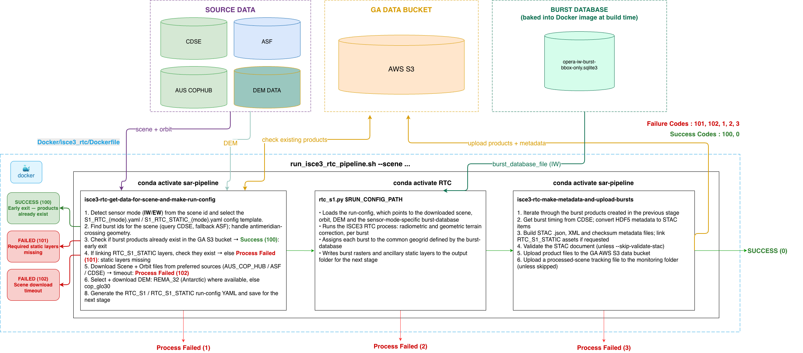

# AWS ISCE3 RTC Pipeline (Sentinel-1 IW NRB)

- [AWS ISCE3 RTC Pipeline (Sentinel-1 IW NRB)](#aws-isce3-rtc-pipeline-sentinel-1-iw-nrb)
  - [1. About](#1-about)
  - [2. Example Products](#2-example-products)
  - [3. Running the Pipeline](#3-running-the-pipeline)
    - [3.1. Overview](#31-overview)
    - [3.2. Environment Variables](#32-environment-variables)
    - [3.3. Pipeline Arguments](#33-pipeline-arguments)
    - [3.4. Example Product Outputs](#34-example-product-outputs)
  - [4. Project Setup](#4-project-setup)
    - [4.1. Docker Image](#41-docker-image)
    - [4.2. Build the Docker Image](#42-build-the-docker-image)
  - [5. Running Tests](#5-running-tests)
  - [6. Release Guide](#6-release-guide)
  - [7. Examples](#7-examples)
    - [7.1 Create RTC Backscatter (RTC\_S1) Without Linking Static Layers](#71-create-rtc-backscatter-rtc_s1-without-linking-static-layers)
    - [7.2. Create Static Layers (RTC\_S1\_STATIC)](#72-create-static-layers-rtc_s1_static)
    - [7.3. Create Static Layers (RTC\_S1\_STATIC) and Link them to a RTC Backscatter Product (RTC\_S1)](#73-create-static-layers-rtc_s1_static-and-link-them-to-a-rtc-backscatter-product-rtc_s1)
      - [7.3.1. Make Static Layers (RTC\_S1\_STATIC)](#731-make-static-layers-rtc_s1_static)
      - [7.3.2. Make RTC Backscatter (RTC\_S1) and Link it to the Static Layers (RTC\_S1\_STATIC)](#732-make-rtc-backscatter-rtc_s1-and-link-it-to-the-static-layers-rtc_s1_static)
      - [7.3.3. Check Backscatter Metadata Outputs to Ensure They are Linked](#733-check-backscatter-metadata-outputs-to-ensure-they-are-linked)
    - [7.4 Production Runs](#74-production-runs)
  - [8. Setting Up a Development Environment](#8-setting-up-a-development-environment)
  - [9. Comparing Products and Making Changes](#9-comparing-products-and-making-changes)
  - [10. Mounting Filesystem at Runtime](#10-mounting-filesystem-at-runtime)


## 1. About 

The isce3_rtc pipeline can be used to create Sentinel-1 Normalised Radar Backscatter (NRB) for data captured in the IW mode. These products are often referred to Radiometric Terrain Corrected (RTC) data. **NRB** and **RTC** are treated as interchangeable terms.

The dependant codebases managed by GA used in the pipeline are:

- [RTC](https://github.com/GeoscienceAustralia/RTC) (this is a fork of the NASA JPL [opera-adt/RTC](https://github.com/opera-adt/RTC))
- [dem-handler](https://github.com/GeoscienceAustralia/dem-handler)
- [sar-pipeline](https://github.com/GeoscienceAustralia/sar-pipeline/tree/main/sar_pipeline)

Using the isce3_rtc pipeline, two main products can be created. These are:

- **RTC_S1** -> Sentinel-1 Radiometrically Terrain Corrected (RTC) / Normalised Radar Backscatter (NRB) [(Specification doc)](https://d2pn8kiwq2w21t.cloudfront.net/documents/ProductSpec_RTC-S1-STATIC.pdf)
- **RTC_S1_STATIC** -> Sentinel-1 (RTC) Static Layers [(Specification doc)](https://d2pn8kiwq2w21t.cloudfront.net/documents/ProductSpec_RTC-S1.pdf)

These products are created at the burst-level to enable the use of static layers that reduce the overall storage footprint of the product. Bursts are repeatable units that a Sentinel-1 satellite captures every 12 days. A typical Sentinel-1 scene consists of ~20-30 bursts. **RTC_S1** is the analysis ready data (ARD) NRB product are unique to each acquisition; for example a gamma0 backscatter geotiff. **RTC_S1_STATIC** products are ancillary layers that can be shared across the same burst id. For example, the local incidence angle. The blank config file used for each run can be found [here](../../sar_pipeline/configs/isce3_rtc/).

## 2. Example Products

The following is an example of **RTC_S1** outputs for a given acquisition. The analysis ready NRB data product is the `HH-gamma0.tif`. Note, This product corresponds with the t007_014545_iw2 static layers below. - https://deant-data-public-dev.s3.ap-southeast-2.amazonaws.com/index.html?prefix=persistent/CEOS-ARD/data/example_2/ga_s1_nrb_iw_hh_0/t007_014545_iw2/2025/01/29/20250129T050922/

```text
ga_s1a_nrb_0-1-0_T007-014545-IW2_20250129T050922Z_HH-gamma0.tif
ga_s1a_nrb_0-1-0_T007-014545-IW2_20250129T050922Z_mask.tif
ga_s1a_nrb_0-1-0_T007-014545-IW2_20250129T050922Z_metadata.h5
ga_s1a_nrb_0-1-0_T007-014545-IW2_20250129T050922Z_metadata.xml
ga_s1a_nrb_0-1-0_T007-014545-IW2_20250129T050922Z_proc-config.yaml
ga_s1a_nrb_0-1-0_T007-014545-IW2_20250129T050922Z_stac-item.json
ga_s1a_nrb_0-1-0_T007-014545-IW2_20250129T050922Z_thumbnail.png
```

The following is en example of **RTC_S1_STATIC** outputs for the t007_014545_iw2 burst id - https://deant-data-public-dev.s3.ap-southeast-2.amazonaws.com/index.html?prefix=persistent/CEOS-ARD/data/example_2/ga_s1_nrb_iw_static_0/t007_014545_iw2/

```text
ga_s1_nrb-static_0-1-0_T007-014545-IW2_20140403_gamma0-to-beta0-ratio.tif
ga_s1_nrb-static_0-1-0_T007-014545-IW2_20140403_gamma0-to-sigma0-ratio.tif
ga_s1_nrb-static_0-1-0_T007-014545-IW2_20140403_incidence-angle.tif
ga_s1_nrb-static_0-1-0_T007-014545-IW2_20140403_local-incidence-angle.tif
ga_s1_nrb-static_0-1-0_T007-014545-IW2_20140403_metadata.h5
ga_s1_nrb-static_0-1-0_T007-014545-IW2_20140403_number-of-looks.tif
ga_s1_nrb-static_0-1-0_T007-014545-IW2_20140403_proc-config.yaml
ga_s1_nrb-static_0-1-0_T007-014545-IW2_20140403_stac-item.json
ga_s1_nrb-static_0-1-0_T007-014545-IW2_20140403_thumbnail.png
```

## 3. Running the Pipeline

### 3.1. Overview

The following diagram displays the overall architecture of the pipeline. Docker is highly recommended to ensure the required environments are correctly configured. The full pipeline run is controlled by the workflow script [run_isce3_rtc_pipeline.sh](../../scripts/run_isce3_rtc_pipeline.sh) that accepts command-line arguments, and passes them to the appropriate process. The main functions used to download, process and upload can be found in the isce3_rtc [cli.py](../../sar_pipeline/pipelines/isce3_rtc/cli.py) script. 




### 3.2. Environment Variables

At runtime, the pipeline expects the following environment variables to be set. These can be passed in using an environment file (`.env`). NASA earthdata credentials can be created here - https://urs.earthdata.nasa.gov/. Credentials for the Copernicus Data Space Ecosystem (CDSE) can be created here - https://dataspace.copernicus.eu/. Credentials for the Copernicus Australasian Datahub (AUS_COP_HUB) were provided internally. The AUS_COP_HUB can be contacted at CopernicusAustralasia@ga.gov.au or via the [website](https://www.copernicus.gov.au/).

[.env.example](../../.env.example)

```txt
EARTHDATA_LOGIN=
EARTHDATA_PASSWORD=
CDSE_LOGIN=
CDSE_PASSWORD=
AWS_ACCESS_KEY_ID=
AWS_SECRET_ACCESS_KEY=
AWS_DEFAULT_REGION=
AUS_COP_HUB_LOGIN=
AUS_COP_HUB_PASSWORD=
AUS_COP_HUB_CLIENT_ID=odata
AUS_COP_HUB_CLIENT_SECRET=
```

### 3.3. Pipeline Arguments 
At runtime, the script [run_isce3_rtc_pipeline.sh](../../scripts/run_isce3_rtc_pipeline.sh) is run. The arguments that can be passed to the container are as follows:

```bash
# Basic input for product creation
--scene="" (required)
--burst_id_list=()
--resolution=20
--output_crs="UTM"
--dem_type=("REMA_32" "cop_glo30") # order of preference, if data available for scene
--product="RTC_S1"
--backscatter_convention=gamma0 # gamma0, sigma0 or beta0
--s3_bucket="deant-data-public-dev"
--s3_project_folder="baseline"
--collection_number=0
--make_existing_products=false
--skip_upload_to_s3=false
--scene_data_source=("AUS_COP_HUB" "ASF" "CDSE") # order of preference
--orbit_data_source=("ASF" "CDSE")  # order of preference
--skip_validate_stac=false
# Required inputs for linking RTC_S1_STATIC to RTC_S1
# Assumes that a RTC_S1_STATIC products exist for all RTC_S1 bursts being processed
--link_static_layers=false           
--linked_static_layers_s3_bucket="deant-data-public-dev"
--linked_static_layers_s3_project_folder="baseline" 
--linked_static_layers_collection_number=0 

```
- `scene` -> A valid sentinel-1 IW scene (e.g. S1A_IW_SLC__1SSH_20220101T124744_20220101T124814_041267_04E7A2_1DAD)
- `burst_id_list` -> A list of burst ids corresponding to the scene. If not provided, all will be processed. Can be space separated list or line separated.txt file.
- `resolution` -> The target resolution of the products. Default is 20m.
- `output_crs` -> The target crs of the products. If not specified, the UTM of the scene center will be used or polar stereographic coordinates will be used for high latitudes above 60 degrees. Expects integer values (e.g. `3031`)
- `dem_type` -> The preference of digital elevation model (DEM) to download and use for processing. Can be passed as a string or list of preferences separated by a space. If DEM data does not exist in the area of the first preference, the next will be used. E.g. `--dem-type REMA_32 cop_glo30` will first look for the Antarctic specific REMA DEM @32m before settling on the cop_glo30. Values must be one of: `cop_glo30`, `REMA_32`, `REMA_10`, `REMA_2`.
- `product` -> The product being created with the workflow. Must be `RTC_S1` or `RTC_S1_STATIC`.
- `backscatter_convention` -> the output backscatter convention from the workflow. Allowed values are [`beta0`,`sigma0`,`gamma0`] Note sigma0 data is referenced to the DEM. To create sigma0 ellipsoid referenced data, the beta0 layer and static incidence_angle layer is required; sigma0_ellipsoid = beta0*sin(incidence_angle).
- `s3_bucket` -> the AWS S3 bucket to upload the products
- `s3_project_folder` -> The AWS S3 project folder to upload to.
- `collection_number` -> The collection number of the product as an integer.
- `make_existing_products` -> Whether to generate products even if they already exist in AWS S3 under the specified product folder path `s3_bucket/s3_project_folder/collection/...`. 
  - **WARNING** - Passing this flag will create duplicate files and overwrite existing metadata, which may affect downstream workflows.
- `skip_upload_to_s3` -> Make the products, but skip uploading them to AWS S3.
- `scene_data_source` -> Where to download the scene SLC file. Can be single string or a list of preferences separated by a space. Supported values are any of `AUS_COP_HUB`, `ASF` or `CDSE`. The default is (`AUS_COP_HUB` `ASF` `CDSE`).
- `orbit_data_source` -> Where to download the orbit files.  Can be single string or a list of preferences separated by a space. Can be any of `ASF` or `CDSE`. The default is (`ASF` `CDSE`).
- `skip_validate_stac` -> To skip validation of the created STAC doc within the code. If this is not set and the stac is invalid, products will not be uploaded. By default we want to validate the stac.
- `link_static_layers` -> Flag to link RTC_S1_STATIC to RTC_S1
- `linked_static_layers_s3_bucket` -> bucket where RTC_S1_STATIC stored
- `linked_static_layers_s3_project_folder` -> folder within bucket where RTC_S1_STATIC stored
- `linked_static_layers_collection_number` -> The collection number of the linked RTC_S1_STATIC product.

### 3.4. Example Product Outputs

Final product output paths have the following structure

**RTC_S1**
- s3_bucket/s3_project_folder/odc_product_name/burst_id/year/month/day/*files
- odc_product_name is determined by the polarisation and collection_number for RTC_S1 products.
- It will be one of ga_s1_nrb_iw_vv_vh_X, ga_s1_nrb_iw_vv_X, ga_s1_nrb_iw_hh_hv_X, ga_s1_nrb_iw_hh_X, where X is the collection_number
- example -> https://deant-data-public-dev.s3.ap-southeast-2.amazonaws.com/index.html?prefix=persistent/repositories/sar-pipeline/tests/sar_pipeline/isce3_rtc/results/ga_s1_nrb_iw_hh_1/t070_149815_iw3/2022/01/01/20220101T124752/

**RTC_S1_STATIC**
- e.g. s3_bucket/s3_project_folder/odc_product_name/burst_id/*files
- odc_product_name = ga_s1_nrb_iw_static_X, where X is the collection_number
- example -> https://deant-data-public-dev.s3.ap-southeast-2.amazonaws.com/index.html?prefix=persistent/repositories/sar-pipeline/tests/sar_pipeline/isce3_rtc/results/ga_s1_nrb_iw_static_1/t045_095837_iw1/


## 4. Project Setup

### 4.1. Docker Image

The workflow is best run using the docker image as multiple conda environments are required. The docker file can be found at [Docker/isce3_rtc/Dockerfile](../../Docker/isce3_rtc/Dockerfile). As can be seen in the Dockerfile, the image utilises 3 conda environments:

- [sar-pipeline](../../environment.yaml) - The main environment for downloading data and creating metadata
- [pygssearch-env](../../Conda/pygssearch/) - An isolated environment for downloading data from the Copernicus Australasia DataHub
- [RTC](https://github.com/GeoscienceAustralia/RTC/blob/main/Docker/lockfile.lock) - The Geoscience Australia opera-adt/RTC fork that handles the radiometric terrain correction of data.

The Dockerfile also downloads a burst-db file for reference in the workflow. Creating this file is described in the [burst-db docs](.burst-db.md).

The entrypoint of the Docker image is the workflow script [run_isce3_rtc_pipeline.sh](../../scripts/run_isce3_rtc_pipeline.sh). This is the script that orchestrates the activation of the correct environments and ensuring arguments are passed correctly to each stage of the process. 

### 4.2. Build the Docker Image

```bash
docker build -t sar-pipeline -f Docker/isce3_rtc/Dockerfile .
```

```bash
 docker run -it --entrypoint /bin/bash sar-pipeline
```

type `exit` to exit the container

## 5. Running Tests

Testing of the `isce3_rtc` code is facilitated by the pixi package manager (see [Developer Docs](../development/developer_pixi.md)) for details. To effectively test the pipeline, all the environment credentials listed in [3.2. Environment Variables](#32-environment-variables) must be set. Read/write access to the AWS S3 bucket and credentials to download from all of the providers is needed. The tests are defined in the project [pyproject.toml](../../pyproject.toml).

To run all [isce3_rtc related tests](../../tests/sar_pipeline/isce3_rtc), the following can be used:

```bash
pixi run test-isce3-rtc
```

The following test is a complete test of the image build and run for two products. It will compare the products made in the test to accepted products stored on AWS S3 to ensure no breaking changes have been made. It must be run before updates to the main branch.

```bash
pixi run test-isce3-rtc-full-docker-run
```

To test downloads from all data providers.

```bash
pixi run test-isce3-rtc-downloads
```

## 6. Release Guide

1. Create a new branch and make the required changes.

2. Run the pipeline-tests on the current branch.

```bash
pixi run test-isce3-rtc
```

3. Ensure all tests pass and inspect the comparison outputs from the `pixi run test-isce3-rtc-full-docker-run` test. These should be saved into a folder named `compare` at the root of the project. The files describe the changes to the product and metadata.

4. Raise a PR and merge the branch into main after review.

5. Create a new Git Release on the main branch and tag the version appropriately.

6. The release should trigger the workflow [push-image-to-ecr](../../.github/workflows/push-image-to-ecr.yaml) that will build and push the updated image to the AWS ECR repository.

7. If the automated build and push fails, manually tag and upload the docker image to the ECR repository:

```bash
# Ensure AWS Environment Credentials with access to the ECR repository are set

# tag the local image with the appropriate ECR account tag
docker tag sar-pipeline:vX-X-X 451924316694.dkr.ecr.ap-southeast-2.amazonaws.com/dea-dev-s1-nrb-pipeline:vX-X-X

aws ecr get-login-password \
    --region ap-southeast-2 | docker login \
    --username AWS \
    --password-stdin 451924316694.dkr.ecr.ap-southeast-2.amazonaws.com

docker push 451924316694.dkr.ecr.ap-southeast-2.amazonaws.com/dea-dev-s1-nrb-pipeline:vX.X.X
```


## 7. Examples

### 7.1 Create RTC Backscatter (RTC_S1) Without Linking Static Layers

- Note, the `--skip_upload_to_s3` and `--make_existing_products` flags are set so existing products will be made, and no uploads to AWS S3 will occur. 

**Antarctica (single aquisition, single burst)**

```bash
docker run --env-file .env -it sar-pipeline --scene S1A_IW_SLC__1SSH_20220101T124744_20220101T124814_041267_04E7A2_1DAD --s3_project_folder TMP --burst_id_list t070_149815_iw3 --skip_upload_to_s3 --make_existing_products --collection_number 0
```

**Australia (single aquisition, all bursts)**


```bash
docker run --env-file .env -it sar-pipeline --scene S1A_IW_SLC__1SDV_20220130T191354_20220130T191421_041694_04F5F9_1AFD --s3_project_folder TMP --skip_upload_to_s3 --make_existing_products --collection_number 0
```

### 7.2. Create Static Layers (RTC_S1_STATIC)

```bash
docker run --env-file .env -it sar-pipeline --scene S1A_IW_SLC__1SSH_20220101T124744_20220101T124814_041267_04E7A2_1DAD --product RTC_S1_STATIC --s3_project_folder "TMP" --skip_upload_to_s3 --make_existing_products --collection_number 0
```

### 7.3. Create Static Layers (RTC_S1_STATIC) and Link them to a RTC Backscatter Product (RTC_S1)

**Context** - The incoming scene S1A_IW_SLC__1SSH_20220101T124744_20220101T124814_041267_04E7A2_1DAD is a repeat pass acquisition over the burst `t070_149815_iw3`. We want to link the backscatter product for the given acquisition to the static layers for burst `t070_149815_iw3`. We first begin by creating the static layers for the given burst if they do not exist.


#### 7.3.1. Make Static Layers (RTC_S1_STATIC)


```bash
docker run --env-file .env -it sar-pipeline\
--scene S1A_IW_SLC__1SSH_20220101T124744_20220101T124814_041267_04E7A2_1DAD \
--burst_id_list t070_149815_iw3 \
--product RTC_S1_STATIC \
--s3_bucket deant-data-public-dev \
--collection_number 0 \
--s3_project_folder TMP/RTC_S1_STATIC \
--make_existing_products
```

Note, any scene that covers the given burst could be used. For example, the following scene captured 12 days earlier on the same repeat orbit could be used `S1A_IW_SLC__1SSH_20211220T124745_20211220T124815_041092_04E1C2_0475`

Once the workflow has been completed, you should be able to find the static layers at:

https://deant-data-public-dev.s3.ap-southeast-2.amazonaws.com/index.html?prefix=TMP/RTC_S1_STATIC/ga_s1_nrb_iw_static_0/t070_149815_iw3/

#### 7.3.2. Make RTC Backscatter (RTC_S1) and Link it to the Static Layers (RTC_S1_STATIC)

```bash
docker run --env-file .env -it sar-pipeline:v0.5 \
--scene S1A_IW_SLC__1SSH_20211220T124745_20211220T124815_041092_04E1C2_0475 \
--burst_id_list t070_149815_iw3 \
--product RTC_S1 \
--s3_bucket deant-data-public-dev \
--collection_number 0 \
--s3_project_folder TMP/RTC_S1 \
--link_static_layers \
--linked_static_layers_s3_bucket deant-data-public-dev \
--linked_static_layers_collection_number 0 \
--linked_static_layers_s3_project_folder TMP/RTC_S1_STATIC
--make_existing_products
```

Once the workflow has been completed, you should be able to find the backscatter data at:

https://deant-data-public-dev.s3.ap-southeast-2.amazonaws.com/index.html?prefix=TMP/RTC_S1/ga_s1_nrb_iw_hh_0/t070_149815_iw3/2021/12/20/20211220T124752/


#### 7.3.3. Check Backscatter Metadata Outputs to Ensure They are Linked

Check the [stac metadata file](https://deant-data-public-dev.s3.ap-southeast-2.amazonaws.com/TMP/RTC_S1_STATIC/ga_s1_nrb_iw_static_0/t070_149815_iw3/ga_s1_nrb-static_0-1-0_T070-149815-IW3_20140403_stac-item.json)

By opening the stac metadata file and checking the assets links, you should see the links for auxiliary products reference the static layers. For example, compare the href in the product metadata below. `hh_gamma0` data belongs to the `RTC_S1` folder and `oa_number_of_looks` belongs to the `RTC_S1_STATIC` folder. We can therefore re-use the Static Layers across multiple RTC_S1 products

```json
 "assets": {
    "hh_gamma0": {
      "href": "https://deant-data-public-dev.s3.ap-southeast-2.amazonaws.com/TMP/RTC_S1/ga_s1_nrb_iw_hh_0/t070_149815_iw3/2021/12/20/20211220T124752/ga_s1a_nrb_0-1-0_T070-149815-IW3_20211220T124752Z_HH-gamma0.tif",
      "type": "image/tiff; application=geotiff; profile=cloud-optimized",
      "title": "hh_gamma0",
      "description": "HH polarised gamma0 linear backscatter",
      "proj:shape": [4539, 2387],
      "proj:transform": [20, 0, 241320, 0, -20, -1373780, 0, 0, 1],
      "proj:code": "EPSG:3031",
      "raster:data_type": "float32",
      "raster:sampling": "area",
      "raster:nodata": "nan",
      "processing:level": "L2",
      "roles": [
        "data",
        "backscatter"
      ]
    },
    "oa_number_of_looks": {
      "href": "https://deant-data-public-dev.s3.ap-southeast-2.amazonaws.com/TMP/RTC_S1_STATIC/ga_s1_nrb_iw_static_0/t070_149815_iw3/ga_s1_nrb-static_0-1-0_T070-149815-IW3_20140403_number-of-looks.tif",
      "type": "image/tiff; application=geotiff; profile=cloud-optimized",
      "title": "oa_number_of_looks",
      "description": "number of looks",
      "proj:shape": [4539, 2387],
      "proj:transform": [20, 0, 241320, 0, -20, -1373780, 0, 0, 1],
      "proj:code": "EPSG:3031",
      "raster:data_type": "float32",
      "raster:sampling": "area",
      "raster:nodata": "nan",
      "roles": [
        "data",
        "auxiliary"
      ]
    },

```

### 7.4 Production Runs

Production runs are detailed in the official run-book, but follow a similar pattern to the above example linking static layers: 

1. A bulk run is completed using a month-or-so of scenes in a region of interest to create RTC_S1_STATIC layers.
2. A timeseries over the same region of interest is run for RTC_S1, linking to the above static layers.

The result is a complete timeseries where products are linked to their correct static layers. 

## 8. Setting Up a Development Environment

Development is best done from within the container where edited files are tracked and can tested without needing to rebuild the project. To do this, the sar-pipeline project and run scripts must be mounted at the appropriate location within the container.

```bash
# Start the container interactively and mount folders in the container so changes can be picked up
# Here the /data/working volume is being mounted to the working directory of the container,
# The sar-pipeline directory is being mounted in the container to track changes as we go
# The script is being mounted to the specific script folder from where it is run

docker run --env-file .env -it --entrypoint /bin/bash \
-v $(pwd):/home/rtc_user/sar-pipeline \
-v $(pwd)/scripts:/home/rtc_user/scripts \
-v /data/working:/home/rtc_user/working \
sar-pipeline
```

```bash
# activate sar-pipeline environment and install code in editable mode
# Change permissions on the run_script in-case we make changes there

conda activate sar-pipeline
pip install -e /home/rtc_user/sar-pipeline
chmod +x /home/rtc_user/scripts/run_isce3_rtc_pipeline.sh 
```

Some examples of running the pipeline with changed being implemented

```bash 
# Antarctic scene (single burst)
/home/rtc_user/scripts/run_isce3_rtc_pipeline.sh --scene S1A_IW_SLC__1SSH_20220101T124744_20220101T124814_041267_04E7A2_1DAD --burst_id_list t070_149815_iw3 --skip_upload_to_s3 --make_existing_products --s3_project_folder "TMP"

# Australia scene
/home/rtc_user/scripts/run_isce3_rtc_pipeline.sh --scene S1A_IW_SLC__1SDV_20220130T191354_20220130T191421_041694_04F5F9_1AFD --skip_upload_to_s3 --make_existing_products --s3_project_folder "TMP"
```

## 9. Comparing Products and Making Changes

Once production begins, the generated must have consistent metadata, and the data of the products should be consistent. If changes are made, for example updating a metadata field of installing a new package, we need to ensure the changes are not breaking and the produced data is consistent with existing products. To do this, we can use the `compare-isce3-rtc-products` cli utility in sar-pipeline. This can be run from within the container, or alternatively using conda.

```text
(sar-pipeline) [rtc_user@3d73a09e51fe working]$ compare-isce3-rtc-products --help
Usage: compare-isce3-rtc-products [OPTIONS]

Options:
  --product [RTC_S1|RTC_S1_STATIC]
                                  The product type being compared  [required]
  --local-product-folder-1 DIRECTORY
                                  Path to the local folder containing the
                                  first burst outputs from RTC/opera to
                                  compare
  --local-product-folder-2 DIRECTORY
                                  Path to the local folder containing the
                                  second burst outputs from RTC/opera to
                                  compare
  --s3-product-folder-1 TEXT      Path to the folder in s3 containing the
                                  first burst outputs from RTC/opera to
                                  compare. Ensure AWS_ACCESS_KEY_ID,
                                  AWS_ACCESS_KEY_SECRET, AWS_DEFAULT_REGION
                                  environment variables set if required.
  --s3-product-folder-2 TEXT      Path to the folder in s3 containing the
                                  second burst outputs from RTC/opera to
                                  compare.Ensure AWS_ACCESS_KEY_ID,
                                  AWS_ACCESS_KEY_SECRET, AWS_DEFAULT_REGION
                                  environment variables set if required.
  --s3-bucket TEXT                S3 where outputs are being stored. Required
                                  if s3 folders are set as input
  --out-folder DIRECTORY          Folder to write the outputs of the
                                  comparison to
  --help                          Show this message and exit.
```

For example, comparing the same product from two different runs (Docker image):

```bash
docker run --env-file .env -it --entrypoint /bin/bash -v $(pwd):/home/rtc_user/sar-pipeline sar-pipeline:v0.5
conda activate sar-pipeline
```

```bash

mkdir /home/rtc_user/sar-pipeline/compare 

compare-isce3-rtc-products --product RTC_S1 \
--s3-product-folder-1 TMP/sar-pipeline/isce3_rtc/2025-09-26_01-00-25.078178/test_full_docker_build_and_run/ga_s1_nrb_iw_vv_vh_1/t045_095837_iw1/2020/11/29/20201129T192619/ \
--s3-product-folder-2 TMP/sar-pipeline/isce3_rtc/2025-09-26_01-00-25.078178/test_full_docker_build_and_run/ga_s1_nrb_iw_vv_vh_1/t045_095837_iw1/2020/11/29/20201129T192619/ \
--s3-bucket deant-data-public-dev \
--out-folder /home/rtc_user/sar-pipeline/compare 
```

Several outputs describing the differences in the files are then output to the local `compare` folder:

```bash
ls compare/
>>> file_differences.json  folder_1  folder_2  json_differences.json  tif_differences.json  xml_differences.xml
```


<TODO>


## 10. Mounting Filesystem at Runtime

We may also want to run the docker container directly but mount useful directories to keep track of outputs.

```bash
docker run --env-file .env -v $(pwd)/scripts:/home/rtc_user/scripts -v /data/working:/home/rtc_user/working sar-pipeline --scene S1A_IW_SLC__1SSH_20220101T124744_20220101T124814_041267_04E7A2_1DAD --skip_upload_to_s3 --make_existing_products --s3_project_folder "TMP"

```

```bash
docker run --env-file .env -v $(pwd)/scripts:/home/rtc_user/scripts -v /data/working:/home/rtc_user/working -it sar-pipeline --scene S1A_IW_SLC__1SSH_20220101T124744_20220101T124814_041267_04E7A2_1DAD --burst_id_list t070_149815_iw3 t070_149821_iw1 --s3_project_folder TMP --skip_upload_to_s3 --make_existing_products
```